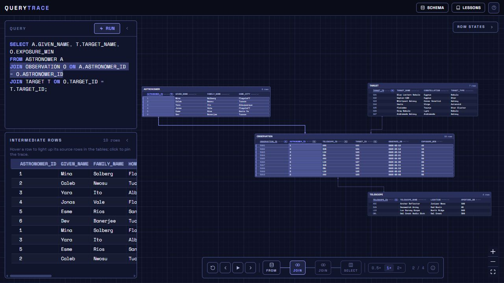

# QueryTrace

[](https://github.com/twbdavis/querytrace/actions/workflows/ci.yml) [](LICENSE)

**Learn SQL by watching a query transform your tables.**

[Open QueryTrace](https://querytrace.net) · [Development guide](docs/development.md) · [Report a bug](https://github.com/twbdavis/querytrace/issues/new/choose)



QueryTrace is a visual SQL learning tool for students, instructors, and anyone
who wants to understand where a query's result comes from. Choose a lesson or
write a query, then step through joins, filters, grouping, and projection.

- **Follow the rows:** see which source records contribute to each result.
- **Learn at your pace:** pause, step, scrub backward, and change playback speed.
- **Bring your own schema:** import supported SQL scripts into an in-browser database.
- **Start without an account:** SQLite runs locally in a Web Worker. Lesson progress
  and custom schemas are saved in browser storage when available.

## Try your first query

1. Open [querytrace.net](https://querytrace.net).
2. Choose a guided lesson and run its query.
3. Step through the stages and select a highlighted row to follow its connections.

All bundled lesson scenarios and records are fictional.

## Run locally

Install **Node.js 24**, then:

```sh
git clone https://github.com/twbdavis/querytrace.git
cd querytrace
npm ci
npm run dev
```

Open **http://localhost:3000**. See the [development guide](docs/development.md)
for tests, production builds, hosting, and troubleshooting.

## Scope and status

A personal learning project with automated tracing and browser checks. The app
teaches logical query stages; it is not a display of SQLite's internal physical
query plan. SQL dialect conversion supports a defined subset, and some complex
queries show branch results plus the final SQLite result rather than a full trace.
Browser storage is local to each browser profile and can be cleared by the browser.

## Built with

Next.js · TypeScript · React · SQLite/WASM · React Flow · CodeMirror · Playwright

[How tracing works](docs/architecture.md) · [Contributing](CONTRIBUTING.md) · [Security](SECURITY.md)

## License

[MIT](LICENSE) © 2026 Thomas Davis.
